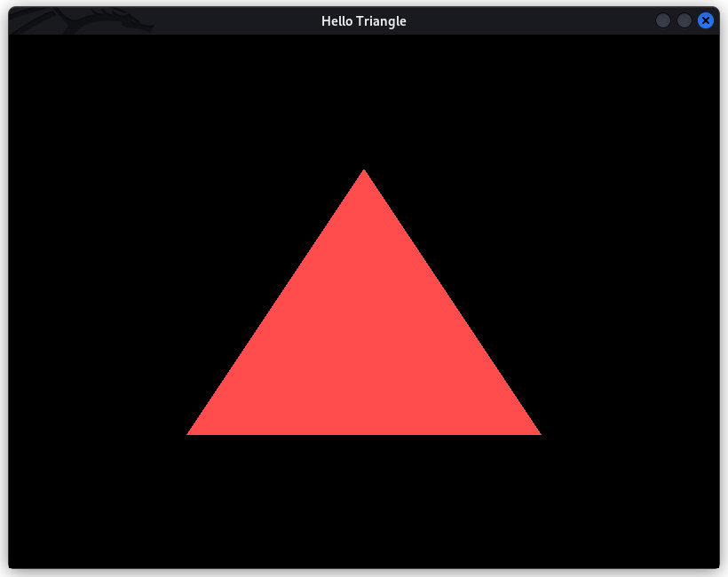

# hello-triangle

"Hello World" in OpenGL!

This program renders a simple triangle using OpenGL.

All requirements are installed automatically with `git`. So, you should be able to run and compile this, out of the box, irrespective of whether you are on Windows or Linux. However, you still need a compiler like [GCC](https://gcc.gnu.org/) and [CMake](https://cmake.org/) installed.

### Installation

```
git clone --recursive https://github.com/a-r-r-o-w/opengl
cd opengl/.dump/hello-triangle-no-dependency-installation
mkdir build
cd build
cmake ..
make
./hello-triangle
```

If your CMake defaults to MSVC compiler and creates Visual Studio solution files (but what you want is MinGW GCC Makefile), you can change the behaviour to Linux-like Makefiles by using:

```
cmake -G "Unix Makefiles" -DCMAKE_MAKE_PROGRAM=mingw32-make ..
mingw32-make
```

If everything works well, you should be able to see a simple red triangle rendered on your screen.


