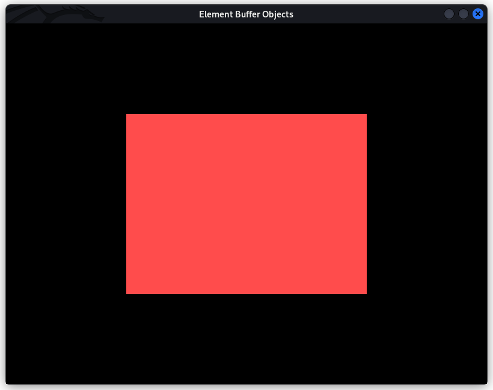
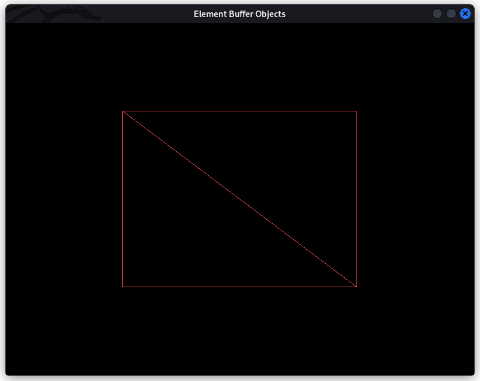

# element-buffer-object

This program renders a simple element buffer object (rectangle) using OpenGL. An element buffer object can re-use vertex data by using indices of the data instead of having an entire different copy of vertex data.

### Requirements

- [CMake](https://cmake.org/)
- [GLFW](https://www.glfw.org/)

### Installation

For Windows and Mac users, you must download/compile GLFW and name the library `libglfw.so` and place it in a directory where CMake can find it. Linux users can run `apt update && apt install libglfw3-dev` to install all requirements (tested on Kali, Ubuntu, Arch).

```
git clone https://github.com/a-r-r-o-w/opengl
cd opengl/basic-concepts/element-buffer-objects
mkdir build
cd build
cmake ..
make
./element-buffer-object
```

If everything works well, you should be able to see a simple red rectangle rendered on your screen.




