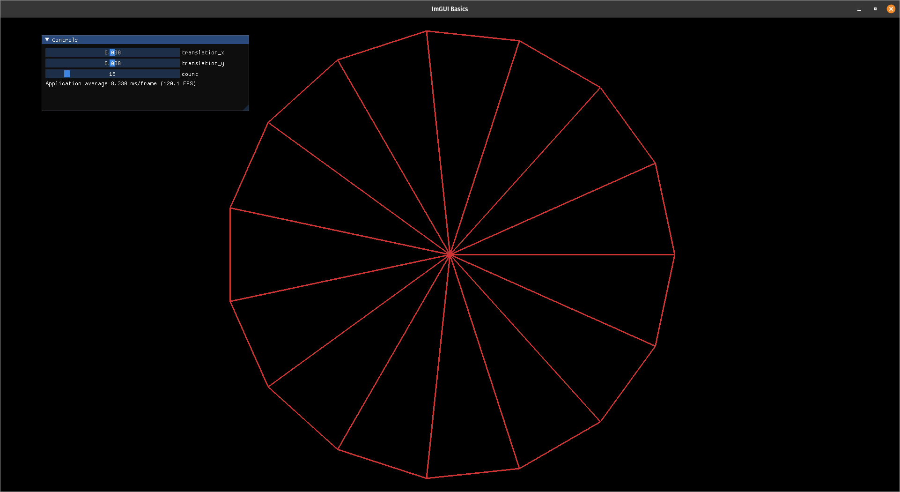
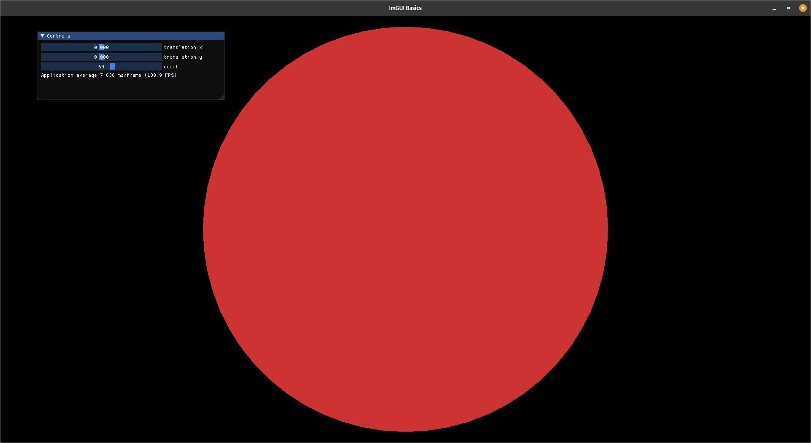

# Circle Generation

Generate a circle using triangles by changing the number of points being renderered.

### Installation

For Windows and Mac users, you must download/compile GLFW and name the library `libglfw.so` and place it in a directory where CMake can find it. Linux users can run `apt update && apt install libglfw3-dev` to install all requirements (tested on Kali, Ubuntu, Arch).

```
git clone --recursive https://github.com/a-r-r-o-w/opengl
cd opengl/circle-generation
mkdir build
cd build
cmake ..
make
./circle-generation
```

If everything goes well, you should get something that looks like:



