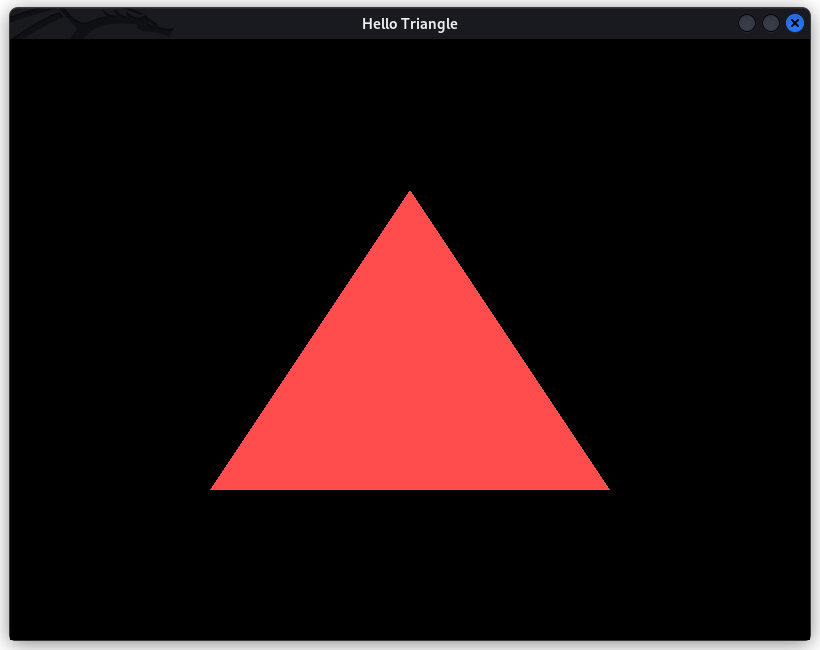

# hello-triangle

"Hello World" in OpenGL!

This program renders a simple triangle using OpenGL.

### Requirements

- [CMake](https://cmake.org/)
- [GLFW](https://www.glfw.org/)

### Installation

For Windows and Mac users, you must download/compile GLFW and name the library `libglfw.so` and place it in a directory where CMake can find it. Linux users can run `apt update && apt install libglfw3-dev` to install all requirements (tested on Kali, Ubuntu, Arch).

```
git clone https://github.com/a-r-r-o-w/opengl
cd opengl/hello-triangle
mkdir build
cd build
cmake ..
make
./hello-triangle
```

If everything works well, you should be able to see a simple red triangle rendered on your screen.


