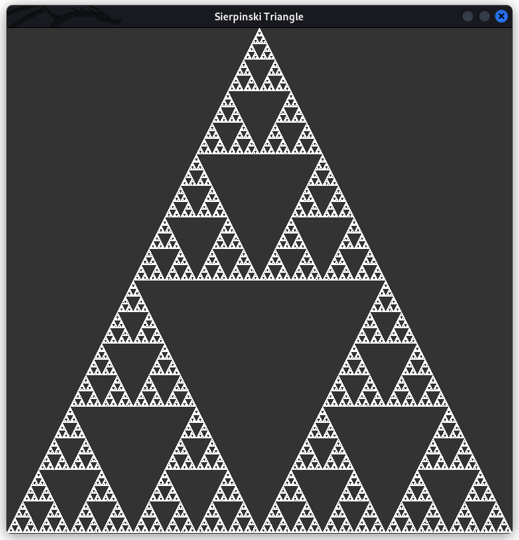
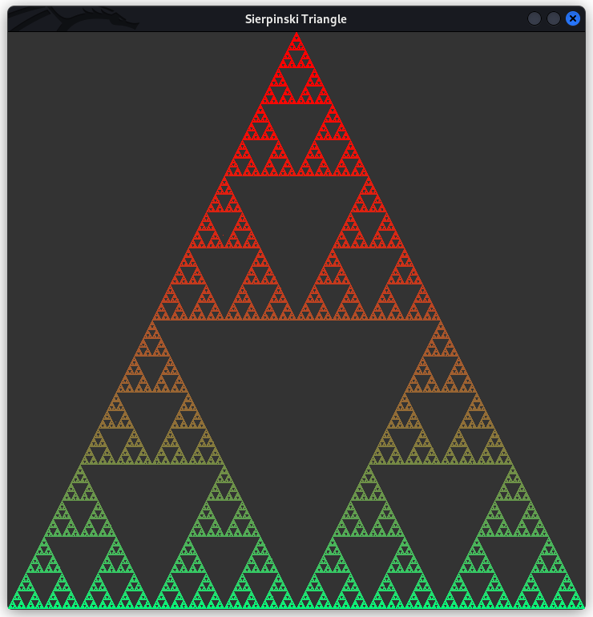
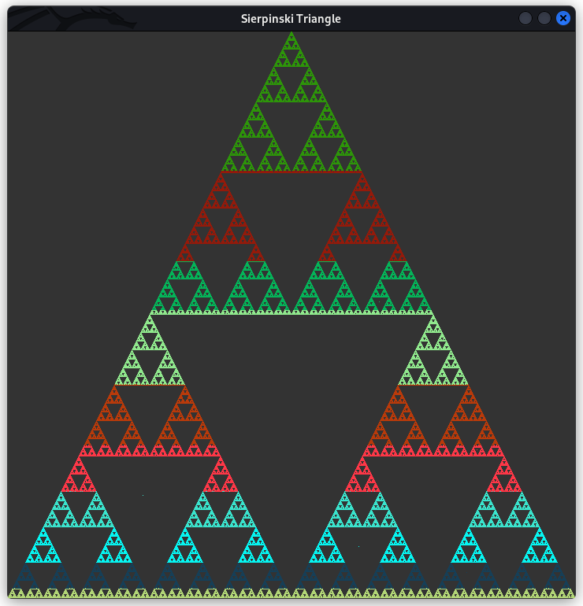

# Sierpinski Triangle

This program generates the famous Sierpinski triangle/gasket/sieve fractal pattern. You can read more about it [here](https://en.wikipedia.org/wiki/Sierpi%C5%84ski_triangle).

The program uses the following algorithm:

```
1) create triangle with 3 arbitrary starting points
2) assign p as a random point (this implementation simply uses one of the vertices of the triangle)
3) select a random vertex v of the triangle
4) assign q as the midpoint of p and the v
5) draw q
6) assign q to p
7) repeat 3-7 for many iterations
```

### Requirements

This program requires the following libraries/tools:

- [GLUT](https://www.opengl.org/resources/libraries/glut/glut_downloads.php)
- [GLM](https://github.com/g-truc/glm)
- [CMake](https://cmake.org/)

Installation instructions for Windows/Mac can be found online. Linux users can install all relevant requirements using `sudo apt install freeglut3 freeglut3-dev libglm-dev cmake`.

### Build

If all libraries have been setup correctly, building the program is really simple.

```
git clone https://github.com/a-r-r-o-w/opengl
cd opengl/sierpinski-triangle-2d
mkdir build
cd build
cmake ..
make
./sierpinski-triangle-2d
```

If everything worked well, you have a Sierpinski Triangle!

https://user-images.githubusercontent.com/72266394/186477427-efe5c6eb-a16d-4291-9da4-66ea1837c479.mp4






